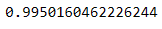
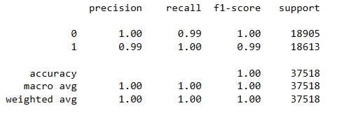

# Credit-Risk-Classification Report

## Overview of the Analysis
  The purpose of the analysis is to determine whether the supervised learning model can accurately predict the creditworthiness (risk level) of borrowers of individual loans. 

  Made up of 77,536 data points, of which 75,036 were healthy loans and 2,500 were high-risk loans.  The dataset was split into a training set and a test set. The training set was used to create an initial logistic regression model using the <a href=https://scikit-learn.org/stable/index.html>scikit-learn</a> LogisticRegression model. The logistic regression model 1 was then applied to the test dataset. The purpose of the model was to determine whether loans to borrowers in the test set were low-risk or high-risk. 

  The data was then resampled using RandomOverSampler model and reprocessed through the LogisticRegression model. Based on the original dataset, 75,036 data points were generated for both low-risk (0) and high-risk (1) loans.

Factors considered in the analysis included the following data for all borrowers:
* Size of the loan
* Interest rate
* Borrower's income
* Debt to income ratio
* Number of accounts the borrower held
* Derogatory marks against the borrower
* Total debt the borrower carries

## The Results

<strong>Logistic Regression Model 1:</strong>

* Balanced accuracy score:  95.2%
* Precision: 100% for healthy-loans and 87% for high-risk loans.  
* Recall: 94% (an average) The model had 100% recall in predicting low-risk loans and 89% recall in predicting high-risk loans.

<strong>Logistic Regression Model 2:</strong>

* Balanced accuracy score: 99.5%
* Precision: 100% for healthy-loans and 99% for high-risk loans.  
* Recall: 99% for the healthy-loans category and 100% for high-risk loans.

## Summary

Overall, the machine learning model predicted credit risk with a high degree of accuracy. If our goal is only to predict healthy loans, the first model will suffice, as it is nearly perfect in this domain. However, the model predicts high-risk loans correctly 85% of the time, and it is inaccurate 15% of the time.  Making this a risky model to use.     

Comparatively, the second model performed better in all aspects. 99% of the second model's high-risk predictions were actually high-risk, and the model predicted 100% of all actual high-risk loans. The accuracy value for the second model is also 99.5%, as opposed to 95.2% for the first model.

The first model may be good enough for an overall sound credit prediction, but the second model is better in all respects. I would recommend using the second model to assess risk levels of new loans.

** Used stackoverflow to resolve module not found error for imblearn module: 'https://stackoverflow.com/questions/50376990/modulenotfounderror-no-module-named-imblearn'