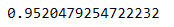

# credit-risk-classification
 Supervised Maching Learning Challenge
  In this challenge, I employed the Machine Learning methods learned to analyze a dataset of a peer-to-peer lending service company and build models that can determine the creditworthiness of borrowers.  

## Overview of the Analysis  
  Made up of 77,536 data points, the dataset was split into a training set and a test set. The training set was used to create an initial logistic regression model using the scikit-learn LogisticRegression module <a href=https://scikit-learn.org/stable/index.html>scikit-learn</a>. The logistic regression model 1 was then applied to the test dataset. The purpose of the model was to determine whether loans to borrowers in the test set were low-risk or high-risk. 

  This original model was based on a dataset containing 75,036 data points for low-risk loans and 2,500 data points for high-risk loans. To resample the training data and ensure that the logistic regression model extracted the same number of data points, the training set data was resampled using the RandomOverSampler module. Based on the original dataset, 56,277 data points were generated for both low-risk (0) and high-risk (1) loans.

  Using the resampled data to buildf a new logistic regression model (logistic regression 2). The purpose of this logistic regression model was to determine whether loans in the test set fell into the low-risk or high-risk classification.

Factors considered in the analysis included the following data for all borrowers:
* Size of the loan
* Interest rate
* Borrower's income
* Debt to income ratio
* Number of accounts the borrower held
* Derogatory marks against the borrower
* Total debt the borrower carries

## The Results

<strong>Logistic Regression Model 1:</strong>

* Balanced accuracy score:  94.4%
* Precision: 100% for healthy-loans and 87% for high-risk loans.  
* Recall: 94% (an average) The model had 100% recall in predicting low-risk loans and 89% recall in predicting high-risk loans.

<strong>Logistic Regression Model 2:</strong>

* Balanced accuracy score:  99.5%
* Precision: 100% for healthy-loans and 87% for high-risk loans.  
* Recall: 94% (an average) The model had 100% recall in predicting low-risk loans and 100% recall in predicting high-risk loans.

## Summary

Overall, the machine learning model predicted credit risk fairly accurately. If our goal is only to predict healthy loans, the first model will suffice, as it is nearly perfect in this domain. However, the model predicts high-risk loans correctly 87% of the time, with a balanced accuracy score of 94.4%,    

Comparatively, the second model had no improved accuracy performance for high-risk loans, again, 87% of the model's high-risk predictions were accurate. However, the balanced accuracy for the second model improved to 99.5%, as opposed to 94.4% for the first model.

The first model may be good enough for an overall sound credit prediction, but the second model is better in all respects. I would recommend using the second model to assess risk levels of new loans.

** Used stackoverflow to resolve module not found error for imblearn module: 'https://stackoverflow.com/questions/50376990/modulenotfounderror-no-module-named-imblearn'